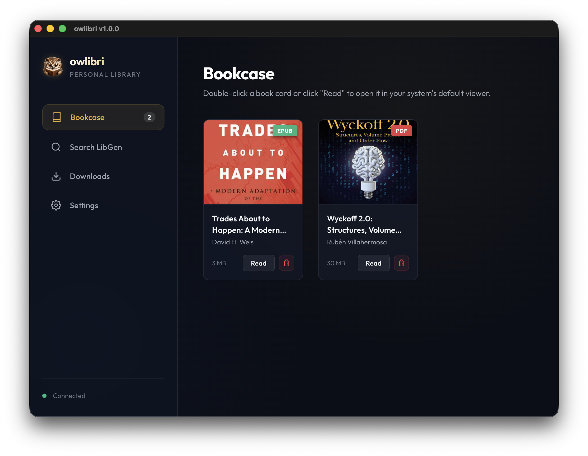
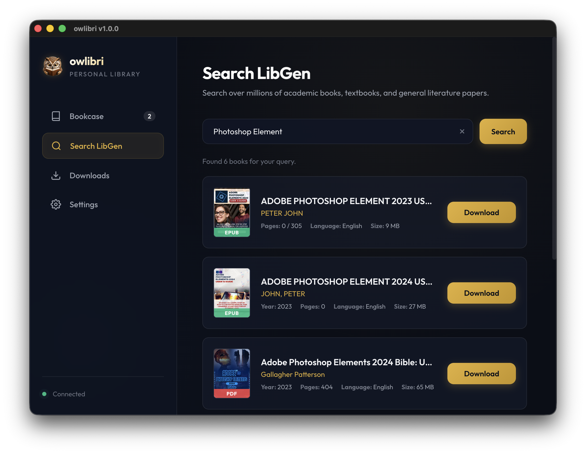

# owlibri 🦉

  

Glassmorphic desktop bookcase and LibGen downloader.

`owlibri` is a lightweight Electron desktop app for searching LibGen mirrors, downloading PDF and EPUB books, and organizing digital books and scientific articles into a local glassmorphic bookcase. If you are looking for a `libgen downloader`, `ebook downloader`, or a local desktop book library, this project is built for that workflow.

---

## What Changed in v1.0.2

* Added Windows auto-update for stable builds so updates can be downloaded and applied without reinstalling manually.
* Improved release publishing with generated notes and cross-platform build artifacts.
* Added download history, so finished downloads can be reopened later with **Open File**.
* Added cover cache controls in Settings and protected bookcase covers from being removed during cleanup.
* Improved search reliability with fallback mirrors, longer timeouts, and clearer error messages.
* Added ETA alongside live download speed in the download queue.

---

## Screenshots

  

---

## Key Features

* **Elegant Bookcase**: Browse and manage your local downloaded library in a visually stunning card grid.
* **Direct LibGen Search**: Search millions of books, papers, and textbooks directly from the application.
* **Search Filters**: Filter results by file type and language, and sort by year to narrow down large LibGen searches quickly.
* **Intelligent Mirror Connection**: Features an automated mirror health checker in the sidebar that pings active mirrors dynamically, so you always know when the search servers are online.
* **Cover Art Resolution**: Automatically parses and resolves book database IDs and MD5s to fetch cover previews dynamically.
* **Advanced Download Manager**: 
  * Optimized download streams for fast and reliable file transfers.
  * Displays real-time download progress, file sizes, status indicators, and live download speed.
  * Native download cancellation support (instantly aborts network requests and cleans up partial temporary files from disk).
* **System-Native Storage**: Saves all of your books in a dedicated, easy-to-access folder inside your user files: `Documents/owlibri/bookcase/`.
* **Instant Reader Launch**: Double-click any book card or click "Read" to open the file immediately inside your operating system's default PDF/EPUB viewer.

---

## How to Install and Run

1. Go to the [Releases](https://github.com/dendyelo/owlibri/releases) page on this repository.
2. Download the appropriate file for your operating system:
   * **macOS**: Download the `.dmg` disk image and drag the app to your `Applications` folder.
   * **Windows**: Download the `.exe` installer and follow the quick setup wizard.
   * **Linux**: Download the `.deb` or `.rpm` package and install it via your package manager.
3. Open the application, head to the **Search LibGen** tab, find your books, and start building your bookcase.

---

## Update Behavior

* **Windows**: stable releases can download and apply updates automatically from GitHub Releases, then prompt you to restart.
* **macOS**: updates are manual. Download the newest `.dmg` from GitHub Releases and replace the app in `Applications`.
* **Linux**: updates are manual. Download the newest `.deb` or `.rpm` package from GitHub Releases and install it over the existing version.

---

## File Storage & Database

All book database entries and downloaded files are kept strictly local to your machine. You can find your physical documents here:
* **Storage Directory**: `Documents/owlibri/bookcase/`

---

## Search Terms

You can find this project on GitHub with terms like:

* `libgen`
* `libgen downloader`
* `ebook downloader`
* `pdf downloader`
* `epub downloader`
* `desktop bookcase`
* `electron book manager`
* `academic books`

---

## License

This application is distributed under the MIT License.
